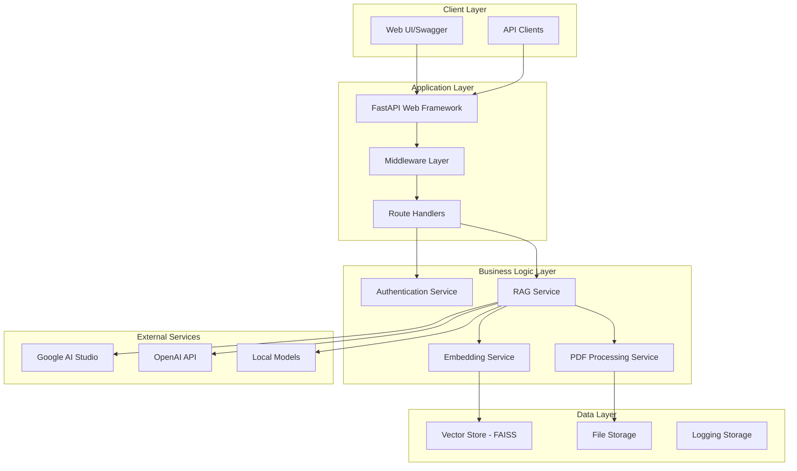

# 🤖 RAG Application API

A comprehensive **Retrieval-Augmented Generation (RAG)** application built with FastAPI that enables users to upload PDF documents, process them with advanced AI techniques, and ask natural language questions to get intelligent answers based on the document content.

[](https://www.python.org/downloads/)
[](https://fastapi.tiangolo.com)
[](https://www.docker.com/)
[](./tests/)

## 🚀 Features

- **📄 PDF Document Processing**: Upload and automatically process PDF documents
- **🤔 Natural Language Q&A**: Ask questions about your documents in plain English
- **🔄 Real-time Streaming**: Get AI responses with live streaming for better UX
- **🔒 JWT Authentication**: Secure API access with JSON Web Tokens
- **🌐 Multiple LLM Providers**: Support for Google AI Studio, OpenAI, and local models
- **📊 Vector Database**: Fast document retrieval using FAISS similarity search
- **🏠 Local Embeddings**: Run completely offline with sentence-transformers
- **📈 Comprehensive Logging**: Detailed request/response logging with middleware
- **🧪 Full Test Suite**: 58+ unit and integration tests with 90%+ coverage
- **🐳 Docker Ready**: Containerized deployment with multi-stage builds

## 🏗️ System Architecture

### High-Level Architecture



### Component Architecture

#### 🌐 **API Layer** (FastAPI)
- **Health Check**: System status monitoring
- **Authentication**: JWT-based user authentication  
- **Document Upload**: PDF file processing pipeline
- **Question Answering**: RAG-powered Q&A with streaming
- **Middleware**: Request logging, authentication, CORS

#### 🧠 **RAG Pipeline**
```
PDF Upload → Text Extraction → Chunking → Embeddings → Vector Store → Question → Retrieval → LLM → Answer
```

1. **Document Ingestion**: 
   - PDF text extraction using PyPDF
   - Intelligent text chunking with LangChain
   - Metadata enrichment (filename, user, timestamp)

2. **Embedding Generation**:
   - Local: sentence-transformers (all-MiniLM-L6-v2)
   - Remote: OpenAI text-embedding-ada-002
   - Vector storage in FAISS index

3. **Retrieval & Generation**:
   - Semantic similarity search (Top-K retrieval)
   - Context ranking and filtering
   - LLM answer generation with streaming
   - Confidence scoring based on retrieval quality

#### 📊 **Vector Database** (FAISS)
- High-performance similarity search
- In-memory vector storage
- Cosine similarity matching
- Scalable to millions of vectors

#### 🔐 **Security Layer**
- JWT token-based authentication
- Middleware-based route protection
- Request/response sanitization
- Secure file upload validation

## 📚 Technology Stack

### **Core Framework**
| Library | Version | Purpose | Documentation |
|---------|---------|---------|---------------|
| **FastAPI** | 0.100+ | Modern async web framework | [Docs](https://fastapi.tiangolo.com) |
| **Pydantic** | 2.0+ | Data validation and serialization | [Docs](https://docs.pydantic.dev) |
| **Uvicorn** | 0.20+ | ASGI server for production | [Docs](https://www.uvicorn.org) |

### **AI & Machine Learning**
| Library | Version | Purpose | Documentation |
|---------|---------|---------|---------------|
| **LangChain** | 0.1+ | LLM orchestration framework | [Docs](https://python.langchain.com) |
| **LangChain Community** | 0.0.20+ | Community integrations | [Docs](https://python.langchain.com) |
| **OpenAI** | 1.0+ | GPT models and embeddings | [Docs](https://platform.openai.com/docs) |
| **Google GenerativeAI** | 0.3+ | Gemini models integration | [Docs](https://ai.google.dev) |
| **Sentence Transformers** | 2.2+ | Local embedding models | [Docs](https://www.sbert.net) |
| **FAISS** | 1.7+ | Vector similarity search | [Docs](https://faiss.ai) |

### **Document Processing**
| Library | Version | Purpose | Documentation |
|---------|---------|---------|---------------|
| **PyPDF** | 3.0+ | PDF text extraction | [Docs](https://pypdf.readthedocs.io) |
| **PyPDF2** | 3.0+ | Legacy PDF support | [Docs](https://pypdf2.readthedocs.io) |
| **tiktoken** | 0.5+ | Token counting for OpenAI | [Docs](https://github.com/openai/tiktoken) |

### **Authentication & Security**
| Library | Version | Purpose | Documentation |
|---------|---------|---------|---------------|
| **PyJWT** | 2.8+ | JSON Web Token handling | [Docs](https://pyjwt.readthedocs.io) |
| **Passlib** | 1.7+ | Password hashing utilities | [Docs](https://passlib.readthedocs.io) |
| **Python Jose** | 3.3+ | JWT cryptographic signing | [Docs](https://python-jose.readthedocs.io) |

### **Utilities & Infrastructure**
| Library | Version | Purpose | Documentation |
|---------|---------|---------|---------------|
| **Pydantic Settings** | 2.0+ | Configuration management | [Docs](https://docs.pydantic.dev) |
| **Python Multipart** | 0.0.6+ | File upload handling | [Docs](https://github.com/andrew-d/python-multipart) |
| **HTTPX** | 0.25+ | Async HTTP client | [Docs](https://www.python-httpx.org) |
| **SSE Starlette** | 1.6+ | Server-Sent Events | [Docs](https://github.com/sysid/sse-starlette) |
| **NumPy** | 1.24+ | Numerical computing | [Docs](https://numpy.org) |
| **Colorlog** | 6.7+ | Colored logging output | [Docs](https://github.com/borntyping/python-colorlog) |

### **Development & Testing**
| Library | Version | Purpose | Documentation |
|---------|---------|---------|---------------|
| **Pytest** | 7.4+ | Testing framework | [Docs](https://docs.pytest.org) |
| **Pytest Asyncio** | 0.21+ | Async test support | [Docs](https://pytest-asyncio.readthedocs.io) |
| **Pytest Cov** | 4.1+ | Coverage reporting | [Docs](https://pytest-cov.readthedocs.io) |
| **ReportLab** | 4.0+ | PDF generation for tests | [Docs](https://www.reportlab.com) |

## 🚀 Quick Start

### Prerequisites
- Python 3.8+
- 2GB+ RAM for local embeddings
- OpenAI API key (optional)
- Google AI Studio API key (optional)

### Installation

#### Option 1: Local Development
```bash
# Clone the repository
git clone <repository-url>
cd rag-app

# Create virtual environment
python -m venv venv
source venv/bin/activate  # On Windows: venv\Scripts\activate

# Install dependencies
pip install -r requirements.txt

# Set up environment variables
cp .env.example .env
# Edit .env with your API keys (optional)

# Start the development server
./start.sh
```

#### Option 2: Docker (Recommended)
```bash
# Build and run with Docker Compose
docker-compose up --build

# Or build manually
docker build -t rag-app .
docker run -p 8000:8000 rag-app
```

### API Usage

#### 1. Authentication
```bash
curl -X POST "http://localhost:8000/api/v1/login" \
  -H "Content-Type: application/json" \
  -d '{"email": "admin@example.com", "password": "admin123"}'
```

#### 2. Upload Document
```bash
curl -X POST "http://localhost:8000/api/v1/upload" \
  -H "Authorization: Bearer YOUR_TOKEN" \
  -F "file=@document.pdf"
```

#### 3. Ask Questions
```bash
curl -X POST "http://localhost:8000/api/v1/ask" \
  -H "Authorization: Bearer YOUR_TOKEN" \
  -H "Content-Type: application/json" \
  -d '{"question": "What is the main topic of this document?"}'
```

## 🧪 Testing

### Running Tests
```bash
# Run all tests
python run_tests.py

# Run specific test categories
python run_tests.py --type unit
python run_tests.py --type integration

# Run with coverage
python run_tests.py --coverage

# Manual pytest commands
pytest tests/ -v
pytest tests/test_ask.py::TestAsk::test_ask_success
```

### Test Coverage
- **58+ comprehensive tests**
- **Unit tests**: Each endpoint individually tested
- **Integration tests**: Full workflow testing
- **Mocking**: External dependencies properly mocked
- **Edge cases**: Error handling and validation

## 📁 Project Structure

```
rag-app/
├── app/                          # Main application package
│   ├── __init__.py
│   ├── main.py                   # FastAPI application entry point
│   ├── config.py                 # Configuration management
│   ├── schemas.py                # Pydantic models
│   ├── storage.py                # RAG service initialization
│   ├── logging_config.py         # Logging configuration
│   ├── middleware/               # Custom middleware
│   │   ├── auth_middleware.py    # JWT authentication
│   │   └── logging_middleware.py # Request/response logging
│   ├── routes/                   # API route handlers
│   │   ├── health_check.py       # Health monitoring
│   │   ├── login.py              # Authentication endpoints
│   │   ├── upload.py             # Document upload
│   │   ├── ask.py                # Q&A endpoints
│   │   └── __init__.py
│   └── utils/                    # Utility modules
│       ├── embeddings.py         # Embedding generation
│       ├── vector_store.py       # FAISS operations
│       ├── logger.py             # Logging utilities
│       └── __init__.py
├── tests/                        # Test suite
│   ├── conftest.py               # Pytest fixtures
│   ├── test_health_check.py      # Health endpoint tests
│   ├── test_login.py             # Authentication tests
│   ├── test_upload.py            # Upload tests
│   ├── test_ask.py               # Q&A tests
│   ├── test_ask_stream.py        # Streaming tests
│   ├── test_integration.py       # End-to-end tests
│   └── README.md                 # Test documentation
├── logs/                         # Application logs
├── examples/                     # Usage examples
├── venv/                         # Virtual environment
├── requirements.txt              # Python dependencies
├── pytest.ini                   # Test configuration
├── run_tests.py                  # Test runner script
├── start.sh                      # Development server script
├── Dockerfile                    # Docker configuration
├── docker-compose.yml           # Docker Compose setup
├── .env.example                  # Environment template
├── .gitignore                    # Git ignore rules
└── README.md                     # This file
```

## ⚙️ Configuration

### Environment Variables
```bash
# Application Settings
APP_NAME=RAG Application
DEBUG=false
HOST=0.0.0.0
PORT=8000

# Security
SECRET_KEY=your-secret-key-change-this-in-production
JWT_SECRET=your-jwt-secret-key
JWT_EXPIRATION_HOURS=24
ADMIN_EMAIL=admin@example.com
ADMIN_PASSWORD=admin123

# AI Providers (Optional)
OPENAI_API_KEY=sk-...
GOOGLE_API_KEY=...
LLM_PROVIDER=google  # google, openai, or local

# Processing Settings
USE_LOCAL_EMBEDDINGS=true
EMBEDDING_MODEL=all-MiniLM-L6-v2
CHUNK_SIZE=1000
CHUNK_OVERLAP=200
TOP_K_RETRIEVAL=5
```

### Supported Models

#### Embedding Models
- **Local**: all-MiniLM-L6-v2 (default, 384 dimensions)
- **OpenAI**: text-embedding-ada-002 (1536 dimensions)
- **Custom**: Any sentence-transformers model

#### LLM Providers
- **Google AI Studio**: gemini-1.5-flash (free tier)
- **OpenAI**: gpt-3.5-turbo, gpt-4
- **Local**: Any Hugging Face model (future)

## 🐳 Docker Deployment

### Docker Compose (Recommended)
```yaml
version: '3.8'
services:
  rag-app:
    build: .
    ports:
      - "8000:8000"
    environment:
      - DEBUG=false
      - OPENAI_API_KEY=${OPENAI_API_KEY}
    volumes:
      - ./logs:/app/logs
    restart: unless-stopped
```

### Production Deployment
```bash
# Build production image
docker build -t rag-app:production .

# Run with resource limits
docker run -d \
  --name rag-app \
  -p 8000:8000 \
  --memory="2g" \
  --cpus="1.0" \
  -e DEBUG=false \
  rag-app:production
```

## 📈 Performance & Scaling

### Resource Requirements
- **CPU**: 1+ cores (2+ recommended)
- **Memory**: 2GB+ (4GB+ for large documents)
- **Storage**: 1GB+ for vector indices
- **Network**: Stable connection for API calls

### Optimization Tips
1. **Use local embeddings** for faster processing
2. **Adjust chunk size** based on document type
3. **Enable GPU** for large-scale deployments
4. **Use Redis** for session management
5. **Load balance** multiple instances

## 🔧 Troubleshooting

### Common Issues

**Import Errors**
```bash
pip install --upgrade pip
pip install -r requirements.txt
```

**Memory Issues**
```bash
# Reduce chunk size
export CHUNK_SIZE=500

# Use smaller embedding model
export EMBEDDING_MODEL=all-MiniLM-L6-v2
```

**API Key Issues**
```bash
# Check environment variables
echo $OPENAI_API_KEY
echo $GOOGLE_API_KEY

# Use local models
export LLM_PROVIDER=local
export USE_LOCAL_EMBEDDINGS=true
```

## 🤝 Contributing

1. Fork the repository
2. Create a feature branch (`git checkout -b feature/amazing-feature`)
3. Commit your changes (`git commit -m 'Add amazing feature'`)
4. Push to the branch (`git push origin feature/amazing-feature`)
5. Open a Pull Request

### Development Guidelines
- Follow PEP 8 style guide
- Add tests for new features
- Update documentation
- Use type hints
- Write descriptive commit messages

## 📄 License

This project is licensed under the MIT License - see the [LICENSE](LICENSE) file for details.

## 📧 Support

- **Issues**: [GitHub Issues](https://github.com/your-org/rag-app/issues)
- **Discussions**: [GitHub Discussions](https://github.com/your-org/rag-app/discussions)
- **Email**: support@rag-app.com

## 🙏 Acknowledgments

- [FastAPI](https://fastapi.tiangolo.com) for the amazing web framework
- [LangChain](https://python.langchain.com) for RAG orchestration
- [FAISS](https://faiss.ai) for high-performance vector search
- [Sentence Transformers](https://www.sbert.net) for local embeddings
- [OpenAI](https://openai.com) and [Google](https://ai.google.dev) for AI models 